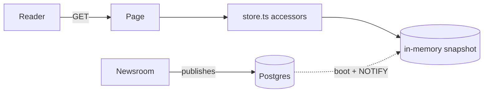
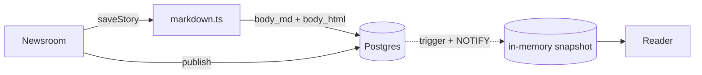
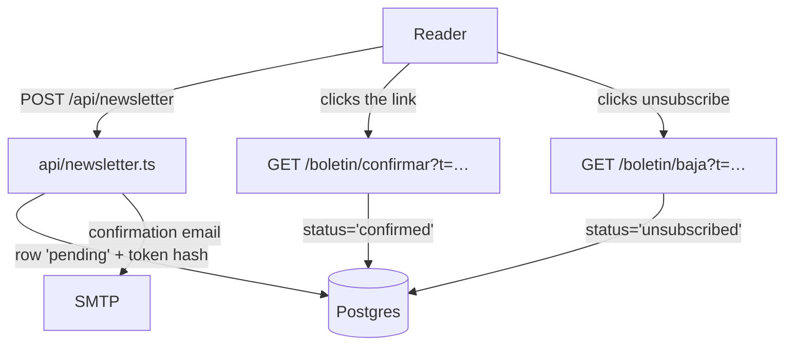

# Architecture

Brotea News is an Astro app with `output: 'server'` (node adapter, standalone):
**every route is rendered per request**, no page opts into prerendering.
Editorial content lives in Postgres, but a request never queries it: pages read
an in-memory snapshot behind async accessors (see [Content layer](#content-layer)).
The exceptions are the two write sides: the newsletter, which writes and reads
its own table per request (see [Newsletter](#newsletter-double-opt-in)), and the
newsroom under `/admin`, which queries Postgres directly because drafts are
precisely what the snapshot does not carry (see
[Newsroom write path](#newsroom-write-path)). No reader waits on Postgres to see
a story.
Runtime and packaging live in [deployment.md](./deployment.md).

## Routes

Spanish is the default locale and is unprefixed; English lives under `/en/`.
The path segments are Spanish in both languages (`/en/noticia/...`), and so are
topic slugs (`macro`, `mercados`, `cripto`, `divisas`) — one slug per topic, not
one per language.

| Spanish | English | File | Renders |
| --- | --- | --- | --- |
| `/` | `/en/` | `src/pages/[...lang]/index.astro` | home: hero, cards, newsletter, author, topics |
| `/noticias` | `/en/noticias` | `[...lang]/noticias.astro` | every story, newest first, grouped by day (`StoryDays`) |
| `/temas` | `/en/temas` | `[...lang]/temas.astro` | topic tiles with counts |
| `/noticia/<slug>` | `/en/noticia/<slug>` | `[...lang]/noticia/[slug].astro` | story page: sanitised `body` HTML (or the pending notice) + `NewsArticle` JSON-LD + related |
| `/tema/<slug>` | `/en/tema/<slug>` | `[...lang]/tema/[slug].astro` | stories of one topic |
| `/autor/<slug>` | `/en/autor/<slug>` | `[...lang]/autor/[slug].astro` | author page + their stories |
| `/boletin/confirmar` | `/en/boletin/confirmar` | `[...lang]/boletin/confirmar.astro` | confirms a subscription from `?t=<token>` |
| `/boletin/baja` | `/en/boletin/baja` | `[...lang]/boletin/baja.astro` | one-click unsubscribe from `?t=<token>` |
| `/legal` | `/en/legal` | `[...lang]/legal.astro` | notice / `#privacidad` / `#cookies` |
| `/search-index.json` | `/en/search-index.json` | `[...lang]/search-index.json.ts` | `GET` search index (JSON) |
| `/404` | `/404` | `404.astro` | 404 page, always in the default locale |

Locale-agnostic endpoints (no language prefix):

| Route | File | Behaviour |
| --- | --- | --- |
| `GET /healthz` | `src/pages/healthz.ts` | `200 {"ok":true,"commit":"<sha or null>"}`, `Cache-Control: no-store` |
| `POST /api/newsletter` | `src/pages/api/newsletter.ts` | subscription request, double opt-in: `202` accepted, `400` invalid email, `429` rate limited, `500`/`503` (see [Newsletter](#newsletter-double-opt-in)) |
| `POST /api/mcp` | `src/pages/api/mcp.ts` | the MCP server: JSON-RPC 2.0 over HTTP, `Authorization: Bearer` on every call, eight tools, no CORS header and no `Origin` check (see [mcp.md](./mcp.md)) |
| `GET /rss.xml` | `src/pages/rss.xml.ts` | RSS 2.0 feed of every story, default locale only (`<language>es-ES</language>`) |
| `GET /sitemap.xml` | `src/pages/sitemap.xml.ts` | every URL in every locale, each with `xhtml:link` hreflang alternates |

Both feeds are built from the snapshot, so a story enters `/rss.xml` and
`/sitemap.xml` the moment it enters the home page — no scheduled job. Absolute
URLs come from `site` in `astro.config.mjs`.

The newsroom lives under `/admin`, always in the default locale and with no
language prefix. Every route there needs a session and every `POST` a CSRF field
(`src/middleware.ts`; access and roles are in [redaccion.md](./redaccion.md)),
and every `/admin` response ships `Cache-Control: no-store` and
`X-Robots-Tag: noindex, nofollow`. The story routes:

| Route | Behaviour |
| --- | --- |
| `GET /admin/noticias` | story list grouped by day; `story:any` sees the whole newsroom, anyone else only their own |
| `POST /admin/noticias` | creates a draft and `303`-redirects to `/admin/noticias/<id>` |
| `GET /admin/noticias/<id>` | the editor; `?idioma=<code>` selects which language row is being edited (default locale if absent or unknown) |
| `POST /admin/noticias/<id>` | `accion=guardar\|publicar\|despublicar` (see [Newsroom write path](#newsroom-write-path)) |
| `GET /admin/mcp` | the MCP keys of whoever is signed in: name, scopes, expiry, last use |
| `POST /admin/mcp` | `action=create\|revoke`; `create` shows the clear token exactly once (see [mcp.md](./mcp.md)) |

Language resolution in every page is `resolveLocale(Astro.params.lang)` from
`src/lib/route.ts`: no prefix → default locale, a published locale → that
locale, anything else → `null`, and the page answers `Astro.rewrite('/404')`.
A missing story/topic/author does the same. `/xx/` therefore 404s instead of
serving the Spanish home under an invented URL.

Legacy `/es*` URLs are 301-redirected in `astro.config.mjs`
(`'/es' → '/'`, `'/es/[...rest]' → '/[...rest]'`).

```bash
curl -s localhost:4321/healthz
# {"ok":true,"commit":"…"}

curl -s localhost:4321/en/search-index.json
# [{"slug":"bce-tipos-septiembre","title":"…","standfirst":"…","topic":"Macro"}, …]

curl -i -X POST localhost:4321/api/newsletter \
  -H 'Content-Type: application/json' \
  -d '{"email":"lector@example.com","locale":"es"}'
# HTTP/1.1 202 Accepted → {"message":"<translated>"}

curl -s 'localhost:4321/boletin/confirmar?t=<token>'   # confirmation page
curl -s 'localhost:4321/en/boletin/baja?t=<token>'     # unsubscribe page

curl -s localhost:4321/rss.xml | head -5
curl -s localhost:4321/sitemap.xml | head -5
```

The search index is one response per locale (`Cache-Control: public,
max-age=0, s-maxage=60, stale-while-revalidate=86400`); filtering happens in the
browser inside `Search.astro`, which fetches it the first time the dialog opens.
It is built from the same snapshot as the pages, so a new story shows up in
search and on the home page at the same instant.

## Content layer

Editorial content lives in Postgres. **No page ever queries it.** The whole
published corpus is loaded into an in-memory snapshot at boot and rebuilt when
the newsroom publishes; the accessors read that snapshot, so rendering a page is
CPU and nothing else — and a Postgres outage does not take the portal down.

```
src/lib/content/types.ts        types only (entities + views)
src/lib/content/store.ts        the accessors every page calls (the read gate)
src/lib/content/snapshot.ts     the in-memory snapshot: init(), current(), contentVersion()
src/lib/content/db.ts           Postgres: migration, snapshot query, LISTEN
src/lib/content/seed.data.json  fallback content and the first-run seed rows
src/migrations/001_content.sql  the schema
src/middleware.ts               boots the snapshot, sets ETag / Cache-Control
```



### Data model

`src/migrations/001_content.sql`. Translatable text lives in **rows per locale**,
not in a `jsonb` column, so editing one language never overwrites another.

| Table | Columns |
| --- | --- |
| `authors` | `id` PK, `slug` UNIQUE, `name`, `created_at`, `updated_at` |
| `author_i18n` | `author_id`, `locale` (PK together), `role`, `bio` |
| `topics` | `id` PK, `slug` UNIQUE, `sort_order` |
| `topic_i18n` | `topic_id`, `locale` (PK together), `name` |
| `stories` | `id` PK, `slug` UNIQUE, `topic_id`, `author_id`, `relevance` (`high\|medium\|low`), `status` (`draft\|scheduled\|published\|archived`, default `draft`), `published_at`, `reading_minutes`, `lead`, `created_at`, `updated_at` |
| `story_i18n` | `story_id`, `locale` (PK together), `title`, `standfirst`, `body_md`, `body_html` |
| `content_version` | single row (`id boolean PK CHECK (id)`), `version bigint` |
| `schema_migrations` | `version` PK, `applied_at` |

- The snapshot only loads `status='published' AND published_at <= now()`, so
  drafts and scheduled stories are invisible to readers.
- A partial unique index (`stories_one_lead ... WHERE lead AND status='published'`)
  makes two lead stories impossible.
- `body_md` is what the newsroom typed (the editor loads it back to keep
  writing); `body_html` is the render of that Markdown, written by `saveStory()`
  and never by hand. Templates print `body_html` with `<Fragment set:html>` — it
  is stored already escaped and rendered, so no template is responsible for
  sanitising ([Newsroom write path](#newsroom-write-path)). A story without
  `body_html` renders the `article.body-pending` copy instead of an invented text.

### Snapshot and invalidation

`snapshot.ts` holds one `ContentSource` plus its version number, swapped whole
on every refresh:

1. `init()` is called from `src/middleware.ts` on every request and memoised, so
   only the first request ever waits — and it **never throws**.
2. Without `DATABASE_URL` it logs and serves `seed.data.json`. That is the local
   and CI mode: the portal runs with no database at all.
3. With `DATABASE_URL`: `migrate()` → `refresh()` → `listen()`. If any of that
   fails (Postgres down, unreachable, mid-restart) the error is logged and the
   seed keeps being served; the process still boots and `/healthz` still answers.
4. `refresh()` runs one query per table (`loadSnapshot()`) and swaps the whole
   object. **If the query returns zero stories the previous snapshot is kept** —
   a half-failed read must not blank the home page.
5. `listen()` opens a *dedicated* connection (outside the pool, since `LISTEN`
   occupies it forever) and runs `LISTEN contenido`. On connection error it
   retries every 5s.
6. Any `INSERT/UPDATE/DELETE` on `stories`, `story_i18n`, `authors` or
   `author_i18n` fires the `bump_content_version()` trigger, which increments
   `content_version.version` and `pg_notify('contenido', <version>)`. The app
   rebuilds the snapshot on that notification — not per visit.

`market` is **not** in the database yet: `loadSnapshot()` still takes it from
`seed.data.json`.

Connection pool (`db.ts`): `max: 5`, `connectionTimeoutMillis: 5000`,
`idle_in_transaction_session_timeout: 10000`, and a `pool.on('error')` handler —
without it a dropped database connection would kill the whole node process.

### ETag and caching

`src/middleware.ts` stamps every cacheable `200 GET` response:

```
ETag: W/"v<contentVersion>-<pathname>"
Cache-Control: public, max-age=0, s-maxage=60, stale-while-revalidate=86400
```

A matching `If-None-Match` gets `304` with no body. The version comes from
`content_version`, so publishing invalidates every page at once and nobody has
to remember to purge anything. `/api/*` and `/healthz` are excluded.

```bash
etag=$(curl -sI localhost:4321/ | grep -i '^etag:' | cut -d' ' -f2- | tr -d '\r')
curl -sI -H "If-None-Match: $etag" localhost:4321/ | head -1
# HTTP/1.1 304 Not Modified
```

These headers are **enforced, not conventional**: `npm run gate:web` requests
every public page and fails if the response lacks `s-maxage` or `ETag`, if
`/admin/entrar` is not `no-store` + `noindex`, or if `/healthz` carries an
`ETag` (see [gate-web.md](./gate-web.md)).

### Contract

`src/lib/content/types.ts` — types only:

- `Localized = Record<Locale, string>` — the same text in every published language.
- Entities, shaped like the rows: `Author` (`id`, `slug`, `name`, `role`,
  `bio`), `Topic` (`id: TopicId`, `slug`, `name`), `Story` (`id`, `slug`,
  `topicId`, `authorId`, `relevance`, `publishedAt` ISO-8601 UTC,
  `readingMinutes`, `title`, `standfirst`, `lead`, optional `body` — the
  sanitised HTML per locale), `Quote` (`id`, `name`, `value`, `decimals`,
  `changePct`), `MarketSnapshot` (`quotes`, `asOf`, `delayMinutes`, `sample`)
  and `ContentSource` grouping all of them.
- Views, one entity already resolved for one language: `AuthorView`,
  `TopicView` (adds `count`), `StoryView` (adds `topicName`, `topicSlug`,
  `body` — sanitised HTML or `''` — and a nested `AuthorView`). **Views carry
  plain strings, never `Localized`** — no component has to know how a language
  is picked.

`src/lib/content/store.ts` — the only read gate. Every accessor is `async`:

| Accessor | Returns |
| --- | --- |
| `getLeadStory(locale)` | `StoryView` — the flagged lead, else the newest; throws if there is none |
| `getArticles(locale)` | `StoryView[]`, newest first |
| `getStory(slug, locale)` | `StoryView \| null` |
| `getStoriesByTopic(topicId, locale)` | `StoryView[]` |
| `getTopics(locale)` | `TopicView[]` with published counts |
| `getTopic(slug, locale)` | `TopicView \| null` — looked up by **slug**, not id |
| `getAuthor(locale)` | `AuthorView` — the portal's single by-line |
| `getAuthors(locale)` | `AuthorView[]` — every by-line; the read gate `list_authors` goes through |
| `getAuthorBySlug(slug, locale)` | `AuthorView \| null` |
| `getStoriesByAuthor(authorId, locale)` | `StoryView[]` |
| `getSearchIndex(locale)` | `{ slug, title, standfirst, topic }[]` |
| `getMarket()` | `MarketSnapshot` — no locale: quote names arrive `Localized` |

Helpers exported alongside them: `localize(value, locale)` (falls back to the
default locale, never to a blank), `isStale(snapshot, now?)` and
`STALE_AFTER_MINUTES = 20`.

Rules:

- **The accessors are the contract.** Moving the source from JSON to Postgres
  changed only the body of `store.ts` (one import: `current()` from
  `snapshot.ts`); no page changed. Keep it that way.
- They stay `async` even though reading memory does not need it: that signature
  is what made the swap possible.
- **Pages must never import the raw data.** `src/lib/content/seed.data.json` is
  plain JSON (so the node test can read it without Vite) and only `db.ts` and
  `snapshot.ts` import it — as the cold-start fallback and as the rows loaded on
  first run.

## Newsroom access (`/admin`)

The private half of the portal: sign in, invite, and edit your public author
profile. Writing stories is not part of it — the dashboard says so
(`admin.pendiente-contenido`) instead of leaving people hunting for a button.

**`/admin` ships zero JavaScript.** Forms that post and redirect, nothing else.
Besides being less to maintain, it guarantees that the newsroom bundle can never
leak into a public page, because it does not exist.

```
src/lib/auth/core.ts        crypto and rules: scrypt, tokens, CSRF, roles, rate limiter
src/lib/auth/store.ts       Postgres: login, sessions, invites, profile, resets, audit
src/lib/auth/mail.ts        invite / reset emails (copy over the shared transport)
src/middleware.ts           session resolution, CSRF, the /admin guard, no-store + noindex
src/layouts/Admin.astro     newsroom chrome: title, robots meta, identity bar, sign-out form
src/pages/admin/*           the pages listed in Routes
src/migrations/003_auth.sql the schema
src/locales/auth.test.mjs   the tests for core.ts
```

The split is deliberate: everything that *cannot be wrong* lives in `core.ts`,
which imports nothing but `node:crypto` and is therefore fully testable in bare
node. `store.ts` is queries only.

### What the middleware does on every request

`src/middleware.ts`, in this order:

1. `init()` — the content snapshot (memoised, never throws).
2. **Session** — `locals.user` is set to `null`, then, if there is a
   `brotea_sesion` cookie *and* `DATABASE_URL` is configured, to
   `sessionFromToken(token)`. A database error is logged and treated as "no
   session": a Postgres blip must not turn `/admin` into an opaque `500`.
3. **CSRF** — on every `POST` outside `/api/`. Mismatch → `403 CSRF`, before
   any page code runs.
4. **Guard** — `/admin/*` without a session → `302` to `/admin/entrar`. The
   public list is a **whitelist** (`entrar|salir|aceptar|restablecer`), not a
   blacklist, so a route added tomorrow is protected by default.
5. Issues a CSRF cookie on any `/admin` request that arrives without one.
6. After rendering: `/admin` responses get `Cache-Control: no-store` and
   `X-Robots-Tag: noindex, nofollow` and return early — they never get an ETag,
   and the public `Cache-Control` never touches them. `Admin.astro` also emits
   `<meta name="robots" content="noindex, nofollow">`.

The `POST` body is read **once**, by the middleware, and travels in
`locals.form`. Pages must read `Astro.locals.form`, never
`Astro.request.formData()`: `request.clone().formData()` returns `null` in
silence over a streaming body with the node adapter, which turned every form
submission into a `403` with a perfectly matching CSRF pair.

`locals` is typed in `src/env.d.ts`: `user: SessionUser | null` and
`form: FormData | null`.

### CSRF: double submit

The same random value in a cookie (`brotea_csrf`, **not** `httpOnly`, so the
form can read it) and in a hidden `csrf` field, compared with `timingSafeEqual`.
It is not a secret from whoever is already on the page; its value is that a
third party cannot read it from another origin. `SameSite=Lax` alone does not
cover a `POST` from a compromised subdomain, and this costs one cookie and one
comparison.

A fresh CSRF cookie is minted on sign-in — reusing the previous one leaves a
valid token behind on a shared computer — and otherwise lasts 24 h.

**Astro's own `checkOrigin` is turned off in `astro.config.mjs`, and that is
the replacement, not a removal.** Behind the node adapter `url.origin` is
`http://localhost` while the browser sends the real domain, so the built-in
check never matches and every newsroom form submission answered `403`. That was
measured, not assumed. If the adapter ever computes the origin correctly,
`checkOrigin` can come back as an extra layer.

### Sessions

Opaque rows in Postgres, not JWTs: revocation has to be instant.

| Property | Value |
| --- | --- |
| Cookie | `brotea_sesion`, `httpOnly`, `sameSite=lax`, `path=/`, `secure` only in a production build (`import.meta.env.PROD`) |
| Stored | `sha256(token)` hex in `sessions.token_hash`. **The clear-text token exists only in the cookie** |
| Token | 32 random bytes, base64url (`newToken()`) |
| Lifetime | 30 days (`SESSION_DAYS`), **sliding**: every request that resolves a session rewrites `expires_at` and `last_seen_at` |
| Comparison | `timingSafeEqual` on the decoded digests (`tokenMatches`) |
| Recorded | `ip` and `user_agent` (truncated to 300 chars) at sign-in |

A session resolves only if the row is not revoked, not expired **and the user is
still `active`**. That last check is what makes suspension real: flipping
`users.status` ejects someone who is already inside on their very next request,
it does not merely stop them coming back.

Revocation happens on sign-out (`POST /admin/salir` → `revoked_at = now()` for
that token) and wholesale on a password reset (every open session of that user).

### Sign-in

`POST /admin/entrar` verifies against `users.password_hash` and answers with
**one message for every failure** (`admin.entrar.mal`). Distinguishing "no such
address" from "wrong password" would turn the form into a list of who writes for
this outlet. For the same reason an unknown address still pays for a full scrypt
verification against a throwaway hash, so response time does not leak the answer
either.

Both outcomes are audited (`login.ok` / `login.failed`), and a success also
stamps `users.last_login_at`, mints a **fresh** CSRF cookie (reusing the old one
leaves a valid token behind on a shared computer) and `303`s to `/admin`.

Rate limits are in-memory, per process, sliding window — the same `RateLimiter`
shape the newsletter uses, declared in `core.ts`:

| Key | Limit |
| --- | --- |
| IP (first entry of `x-forwarded-for`, else `clientAddress`) | 10 per 5 min |
| Email address | 5 per 15 min |

Two keys, not one: otherwise a thousand IPs could hammer one account, or one
attacker could lock a colleague out by failing their address from everywhere. A
successful sign-in clears the account counter, so getting it right on the fifth
try does not leave you locked out. Verifying a password is deliberately
expensive CPU work — without a limit, the hash itself is the attacker's lever.

### Passwords

`scrypt` from `node:crypto`, not argon2: zero dependencies, no native module to
compile, no added supply-chain surface.

```
scrypt$32768$8$1$<salt base64url>$<hash base64url>
```

Per-user 16-byte salt, and the parameters travel **with** the hash so the cost
can be raised tomorrow without invalidating anybody's password. `verifyPassword`
reads N, r and p back out of the stored string, and returns `false` (never
throws) on anything malformed.

**The `maxmem` caveat.** scrypt needs about `128·N·r` bytes — 33.5 MB with
`N=2^15, r=8` — while node's default ceiling is 32 MB. Without raising it,
*every* sign-in attempt throws `memory limit exceeded`. It is therefore computed
from N and r themselves (`maxmemFor = 128·N·r·2`) rather than hardcoded, so
raising the cost later cannot re-break it. A test caught this before production;
it is the single most likely thing to break when someone tunes the parameters.

Policy: **12 characters minimum, no symbol rules** (`passwordProblem`), plus a
200-character ceiling — without it a 1 MB password is free CPU handed to
whoever posts it. Requiring upper-case-number-symbol is what produces
`P@ssw0rd1`, which is worse than a long phrase.

### Invitations

Registration is invitation-only; there is no open sign-up and no
"first-user-becomes-owner" path — that shortcut is a classic vulnerability
(whoever arrives first wins). The first owner is bootstrapped by inserting an
invite row by hand: see [redaccion.md](./redaccion.md).

```mermaid
graph TD
  O[Owner] -->|POST /admin/invitar| I[(invites)]
  I -->|single-use link, 72 h| M[SMTP]
  M -->|inbox| P[Journalist]
  P -->|GET/POST /admin/aceptar?t=…| U[(users + authors)]
  P -->|POST /admin/entrar| S[(sessions)]
  S -->|httpOnly cookie| A[/admin]
  P -->|POST /admin/perfil| AU[(authors + author_i18n)]
  AU -->|content trigger| W[public author block]
```

- Only `owner` has `user:invite`, and the check is `can(user.role,
  'user:invite')` **in the page**, returning `403`. Hiding the dashboard link is
  cosmetics; whoever types the URL meets the `403`.
- The invite row stores `sha256(token)`; the clear-text token only ever reaches
  the mailbox, inside `<site>/admin/aceptar?t=…` built from `Astro.site`
  (falling back to the request origin).
- Expiry is 72 h (`INVITE_HOURS`) and use is single: `accepted_at` set means the
  link is spent and returns `unknown` from then on.
- **If SMTP fails the invitation still exists.** The page then shows
  `admin.invitar.sin-correo` so the owner can resend — losing an invitation to
  an SMTP hiccup would be the worse failure.
- Accepting runs in **one transaction** that creates the public `authors` row
  (id `aut-<slug of the byline>`, accent-stripped), the `users` row (`active`,
  with the invited role and `author_id` pointing at that author) and marks the
  invite accepted. Whoever joins a newsroom comes to sign their work.

### Roles and permissions

A table, not a ladder of `if`s, so it can be read at a glance and tested whole
(`CAN` in `core.ts`). Roles do **not** inherit from one another.

| Permission | journalist | editor | owner |
| --- | --- | --- | --- |
| `profile:own` | ✅ | ✅ | ✅ |
| `story:own` | ✅ | ✅ | ✅ |
| `story:any` | — | ✅ | ✅ |
| `story:publish` | — | ✅ | ✅ |
| `user:invite` | — | — | ✅ |
| `user:role` | — | — | ✅ |
| `mcp:token` | ✅ | ✅ | ✅ |

`mcp:token` is on all three rows because minting a key for one's own Claude
client is not a privileged act, and what the key may do is bounded twice over —
by its scopes and by the role of whoever holds it. It is still a permission of
its own so that "who may point a credential at the public internet" has an
answer that can be narrowed tomorrow without touching a page.

`story:*` are declared but nothing consumes them yet — story editing is a later
feature. `user:role` likewise has no page today. Checks are always server-side
and per route: the dashboard filters its links with `can()` for looks, and the
page itself re-checks and answers `403`.

### Profile editing

`/admin/perfil` writes to the **same tables the public site reads**
(`authors`, `author_i18n`), so a change shows up in the author block
immediately: the content trigger bumps `content_version` and the snapshot
refreshes. One locale at a time (`?idioma=<code>`, validated against `LOCALES`),
which is exactly why translations are rows and not a `jsonb` column — editing
English cannot overwrite Spanish.

A user whose `author_id` is `null` gets `admin.perfil.sin-autor` instead of a
silent no-op: they can sign in, but they sign nothing.

### Audit log

`audit(action, actorId, payload, ip)` writes to `audit_log`. It **never breaks
the action it audits** — a failed insert is logged and swallowed — and the actor
is nullable on purpose, because a failed sign-in has no user and is exactly the
kind of thing worth recording.

Actions written today: `login.ok`, `login.failed`, `logout`, `user.invited`,
`user.accepted_invite`, `profile.updated`, `password.reset`, `mcp.token.issued`,
`mcp.token.revoked`, `mcp.draft.created`, `mcp.draft.updated`.

### Data model

`src/migrations/003_auth.sql`, applied at boot like the others (see
[deployment.md](./deployment.md#migrations)). It needs `citext`, already created
by `002_newsletter`.

| Table | Columns |
| --- | --- |
| `users` | `id` PK, `email` `citext` UNIQUE, `password_hash` (the `scrypt$…` string), `role` (`journalist\|editor\|owner`, default `journalist`), `status` (`invited\|active\|suspended`, default `invited`), `author_id` → `authors(id)` `ON DELETE SET NULL`, `created_at`, `updated_at`, `last_login_at` |
| `invites` | `id` PK, `email` `citext`, `role`, `token_hash` UNIQUE, `invited_by` → `users(id)`, `expires_at`, `accepted_at`, `created_at`; partial index on `email WHERE accepted_at IS NULL` |
| `sessions` | `id` PK, `user_id` → `users(id)` `ON DELETE CASCADE`, `token_hash` UNIQUE, `created_at`, `last_seen_at`, `expires_at`, `revoked_at`, `ip`, `user_agent`; partial index on `user_id WHERE revoked_at IS NULL` |
| `password_resets` | `id` PK, `user_id` → `users(id)` `ON DELETE CASCADE`, `token_hash` UNIQUE, `expires_at`, `used_at`, `created_at` |
| `audit_log` | `id` PK, `actor_id` → `users(id)` `ON DELETE SET NULL` (nullable), `action`, `entity`, `entity_id`, `payload jsonb`, `ip`, `at`; index on `at DESC` |
| `mcp_tokens` | `id` PK, `user_id` → `users(id)` `ON DELETE CASCADE`, `name`, `token_hash` UNIQUE (sha256 hex), `scopes text[]` (`content:read` \| `stories:write`, `<@`-constrained, default read-only), `created_at`, `expires_at` (NULL = never), `last_used_at`, `revoked_at`; partial index on `user_id WHERE revoked_at IS NULL`. Added by `005_mcp_tokens.sql` — see [mcp.md](./mcp.md) |

`users.author_id` is the join between the private account and the public
by-line, and it is deliberately loose in both directions: **a user without an
author can sign in but signs nothing; an author without a user is a historical
by-line** that keeps working after the person leaves. Deleting an author does
not delete the account, it just unlinks it.

The migration creates **no user and no path to create one** without an
invitation.

### Not implemented yet

The code carries more than the interface exposes. Documented so nobody assumes
otherwise:

- **Password reset has no page.** `requestReset()` / `applyReset()` exist in
  `store.ts`, `sendReset()` exists in `mail.ts`, the `password_resets` table
  exists and `/admin/restablecer` is whitelisted as public in the middleware —
  but there is no `src/pages/admin/restablecer.astro`, so the route `404`s and
  nothing calls those functions. A forgotten password is fixed today by issuing
  a new invitation (accepting it re-sets the password for that address).
- **Suspension has no interface.** The enforcement is real (a session dies as
  soon as `users.status` stops being `active`), but the only way to suspend
  someone is `UPDATE users SET status='suspended'` in the database.
- **Changing someone's role has no interface** either, though `user:role` is in
  the permission table.
- **Story editing** (`story:own`, `story:any`, `story:publish`) belongs to a
  later feature; the dashboard says so on the page.

## Newsroom write path

The write side of the same tables the snapshot reads. It is not behind the
accessors on purpose: the point of these screens is the drafts, and the snapshot
only carries what is published.

```
src/lib/markdown.ts                     Markdown → HTML, readingMinutes, slugify
src/lib/newsroom/store.ts               the write accessors (own pool, max: 3)
src/pages/admin/noticias/index.astro    the story list, grouped by day
src/pages/admin/noticias/[id].astro     the editor: write, preview, publish, unpublish
src/locales/markdown.test.mjs           the renderer's tests
```



Its own pool (`max: 3`), like the newsletter's: writing must never contend with
the content layer's connections.

### Permissions

Checked against the **specific story**, not against the screen — a link that is
not painted is cosmetics, and the id is in the URL:

- `[id].astro` loads the draft first. An unknown id is `Astro.rewrite('/404')`,
  like any public page.
- Then `draft.authorId === user.authorId` → allowed; otherwise
  `can(role, 'story:any')` (editor, owner) or a bare `403`.
- `accion=guardar` needs nothing more: whoever passed that check edits the text.
- `accion=publicar` / `accion=despublicar` need `story:publish` (editor, owner).
  Without it the action is not silently skipped: the page answers with the
  `admin.noticias.sin-permiso` notice.
- Creating a draft is open to every role — a journalist starting a story is not
  a privileged act. The row is inserted with the user's `authorId`, which exists
  because accepting an invitation creates the public author record too
  ([redaccion.md](./redaccion.md)).

### `src/lib/newsroom/store.ts`

| Function | Returns / failure modes |
| --- | --- |
| `listStories(locale)` | `StoryRow[]` — **every** story, any status, ordered by `COALESCE(published_at, updated_at) DESC`. `LEFT JOIN`s with fallbacks (`(sin título)`, empty author name) so a barely-started draft still lists instead of disappearing |
| `getDraft(id)` | `StoryDraft \| null` — the row plus one `i18n` entry per existing locale row, carrying `bodyMd` (the Markdown source, never the HTML) |
| `createStory(authorId, topicId)` | the new id, `st-<base36 time>-<base36 random>`, inserted as `draft` with `slug = id` and `reading_minutes = 1`. A timestamped id sorts by itself and does not depend on a headline, which changes a lot before publication |
| `saveStory(input)` | `void`. One transaction: `stories` (topic, relevance, `reading_minutes`, `updated_at`) plus an upsert of one `story_i18n` row (title, standfirst, `body_md`, `body_html`). It renders the Markdown itself; it never publishes and never touches the slug. `reading_minutes` is recomputed from the body just saved |
| `discardEmptyStory(id)` | `void`. Undoes a `createStory()` whose `saveStory()` never landed, and nothing else: it deletes only a `draft` with no `story_i18n` row in any language, a row no reader and no editor ever wanted. Used by the MCP `create_draft` (see [mcp.md](./mcp.md)), so a failed write does not leave a `(sin título)` per retry. Deliberately narrow so it can never widen into a delete-story tool |
| `publish(id, defaultLocale, lead)` | `'ok' \| 'sin-titulo' \| 'slug-repetido'` — the two failures write nothing |
| `unpublish(id)` | `void`: `status='draft'`, `lead=false`. **Deletes nothing** — pulling a story and losing it are different things |

Saving edits one language at a time (`?idioma=<code>`), which is what the
`story_i18n` rows-per-locale model is for: writing the English version cannot
overwrite the Spanish one.

### Publishing

- The slug is computed **at publish time**, from the default-locale title
  (`slugify`, 80 chars max, the id as fallback if the title slugifies to
  nothing). Never while drafting: the headline changes ten times, and a URL that
  moves after publication is a broken link for whoever shared it.
- An already-published story **keeps its slug** when republished.
- No default-locale title → `'sin-titulo'`; the page says a headline is needed.
- Another story already holds that slug → `'slug-repetido'`. It is not resolved
  by appending a number: two identical headlines are a decision for the desk.
- `published_at = COALESCE(published_at, now())` — republishing does not re-date
  a story.
- With `lead`, the previous lead is demoted **inside the same transaction and
  before** the promotion: `stories_one_lead` is a partial unique index, so doing
  it the other way round aborts the transaction.

The story reaches the reader through the machinery already described in
[Snapshot and invalidation](#snapshot-and-invalidation): the `UPDATE` fires
`bump_content_version()`, which bumps the version and `pg_notify`s `contenido`;
the process rebuilds the snapshot and the story is on the home page, in
`/rss.xml`, `/sitemap.xml` and the search index, with every ETag already
invalidated. No rebuild, no restart, no cache to purge. Unpublishing travels the
same path in reverse — the snapshot only loads `status='published'`, so the
story leaves the site on the next refresh while its text stays in the database.

### The two screens

**The list (`index.astro`)** is one list, not two: `listStories()` is filtered to
what the user may see (everything with `story:any`, their own otherwise) and then
grouped by day with `groupByDay()` (see
[Dates and days](#dates-and-days-srclibdatests)). Published stories group by
`publishedAt`, drafts by `updatedAt` — the date that matters while a story is not
out yet. Each day is a `<section>` headed by a sticky `h2` with the day label and
the story count (`topics.count`).

- A row is a **stretched link** to the editor (`.estirado::after { inset: 0 }`),
  so the whole row opens the editor. A published row also carries a "ver en la
  web" link, lifted above the stretched link with `position: relative; z-index: 1`
  — one extra keyboard stop, not three identical ones. `.fila:hover:has(.accion:hover)`
  drops the row's own highlight while the pointer is on that link, so the
  highlight never promises the wrong destination.
- `min-width: 0` on the title cell is load-bearing: without it a long headline
  refuses to shrink and pushes the status and the action out of the row.
- The author name is printed only on **other people's** stories.
- Empty list → a panel with `admin.noticias.ninguna`, `admin.noticias.ninguna-ayuda`
  and the "new story" button, instead of a bare "nothing here".

**The editor (`[id].astro`)** is two columns above 940px: writing on the left
(title, standfirst, body, preview) and a sticky decision rail on the right
(topic, relevance, save; status, publish/unpublish, lead checkbox). Below 940px
it collapses to one column with the rail **after** the text, which is the order
in which the work happens.

The publish and unpublish forms are **separate hidden `<form id="publicar">` /
`<form id="despublicar">` elements** outside the editing form, and the rail's
button and lead checkbox reach them through the HTML `form=` attribute. Nesting
a `<form>` inside another is invalid HTML, and this is what keeps the rail
working with **zero JavaScript**, like the rest of `/admin`.

### `src/lib/markdown.ts`

Markdown is rendered **when the story is saved**, not when it is read, and the
result is stored in `body_html`. That leaves a single door through which HTML
enters the system, instead of trusting every template to escape.

The renderer is hand-written rather than a parser plus a sanitiser, and the
ordering is the security property: **escape first, emit after**. Author text is
escaped (`& < > " '`) on the way in, and only the tags in the table below are
emitted afterwards, so unescaped author HTML never exists at any point — which
is exactly where "parse, then sanitise" chains fail. The price is a reduced
subset of Markdown.

| Input | Output |
| --- | --- |
| `## …` to `#### …` | `<h2>`–`<h4>`. **No `<h1>` is ever emitted**: the page's h1 is the headline, and two h1s break the heading outline for a screen reader. A lone `#` stays a paragraph |
| `**bold**`, `*italic*` | `<strong>`, `<em>` |
| `` `code` `` | `<code>`; extracted before anything else so its contents are not re-interpreted as emphasis |
| `- item`, `1. item` | `<ul>`, `<ol>` |
| `> quote` | `<blockquote><p>…</p></blockquote>` |
| `[text](url)` | `<a href="…">` if the URL passes `safeHref`, else the plain text |
| anything else | `<p>`; consecutive lines join with a space, a blank line closes the paragraph |

`safeHref` allows `http:`, `https:`, `mailto:` and site-relative `/path` only
(`//host` is another origin and is rejected). It matches with whitespace and
hyphens collapsed and lower-cased, so `javascript:`, `JaVaScRiPt:`,
`java script:`, `data:` and `vbscript:` all fail. **A rejected link keeps its
text and loses the anchor** — the reader sees the words, not a dead or dangerous
href. External `http(s)` links get `rel="noopener nofollow"`.

Current limits, stated as limits: no images (the renderer emits no `` and
the editor has no image field), no tables, and no raw HTML — author markup is
escaped and shown as text.

Also exported: `readingMinutes(source)` (200 words per minute, never below 1,
because "0 min read" means nothing) and `slugify(title)` (lower-case, accents
stripped via NFD, non-alphanumerics collapsed to `-`, trimmed, 80 chars).

The editor's preview calls the very same `renderMarkdown`, so what the desk sees
before publishing is the render that gets stored, not an approximation.

The topic dropdown is filled from `getTopics(locale)`, i.e. from the content
snapshot: a topic name is editorial content, not UI copy, so it is never a `t()`
key. The newsroom's own chrome (`admin.noticias.*`) is UI copy and lives in both
locale files; its status family is declared in the `DYNAMIC` map of
`content.test.mjs` because the editor builds those keys from a template.

## MCP server

`POST /api/mcp` lets Claude, running in somebody else's client, read the portal
and write drafts in it. It is the same node process, the same tables and the
same permission model — full detail, including the eight tools and the client
configuration, is in [mcp.md](./mcp.md).

```
src/lib/mcp/protocol.ts            envelope, versions, scopes, tool catalogue, validation
src/lib/mcp/tools.ts               what the tools do (reads through the snapshot)
src/pages/api/mcp.ts               the endpoint: auth, rate limits, dispatch
src/pages/admin/mcp.astro          minting and revoking keys
src/migrations/005_mcp_tokens.sql  the mcp_tokens table
src/locales/mcp.test.mjs           the tests for protocol.ts
```

Four properties worth knowing without opening that document:

- **Writing stops at `draft`.** There is no publish tool, `stories:write` is a
  separate scope that is off by default, and `update_draft` refuses a published
  story. The snapshot only loads published rows, so a draft written over MCP is
  invisible to readers by construction.
- **Read tools never query Postgres**: they go through
  `src/lib/content/store.ts`, like every page.
- **`protocol.ts` has zero relative imports** so `node --test` can load it
  through `src/lib/load-ts.mjs`; that is why `buildTools()` receives the locale
  list instead of importing `config.json`, exactly as `dayLabel()` receives its
  Intl tag.
- **No CORS header, no `Origin` comparison, ever** — re-adding one re-adds the
  `403` that forced `checkOrigin: false`.

## Newsletter (double opt-in)

Subscriptions live in this app's own Postgres. Until feature 59 the form
forwarded the address server-side to the factory's requirements collector
(`PUBLIC_REQUIREMENTS_ENDPOINT`); **that forwarding is gone** — no address
leaves the app any more, and there is no build-time endpoint to configure.

An address is not a subscriber until the reader clicks the link that only
reaches their inbox:



```
src/lib/newsletter/core.ts   pure logic: email normalisation, tokens, expiry, rate limiter
src/lib/newsletter/store.ts  Postgres: signup(), confirm(), unsubscribe()
src/lib/newsletter/mail.ts   SMTP (nodemailer): sendConfirmation()
src/pages/api/newsletter.ts  the POST endpoint
src/pages/[...lang]/boletin/confirmar.astro   confirmation page
src/pages/[...lang]/boletin/baja.astro        unsubscribe page
src/migrations/002_newsletter.sql             the schema
```

`core.ts` deliberately imports nothing but `node:crypto`, so the whole of it
runs under `node --test` (see [Testing](#testing)). It has its own pool
(`max: 3`) in `store.ts`: the newsletter must never contend with the content
layer's connections.

### `POST /api/newsletter`

Request body is JSON; `locale` is optional and falls back to the default locale
if it is not a published one. Every response is
`{"message":"<already translated>"}` with `Cache-Control: no-store`.

| Status | When |
| --- | --- |
| `202` | Accepted. Returned for a brand-new address, a pending one **and** an already-confirmed one — see below |
| `400` | `email` missing or not shaped like an address (`newsletter.invalid`) |
| `429` | Rate limited (`newsletter.too-many`) |
| `503` | No `DATABASE_URL`: nobody can be signed up (`newsletter.error`) |
| `500` | The insert failed (`newsletter.error`) |
| `405` | `GET` on the route, answering `{"message":"POST {email, locale}","max_email":200}` |

**The response never distinguishes a new address from a subscribed one.** If it
did, the public form would be a checker for who reads this outlet. An
already-confirmed address gets the same `202` and no second email.

Rate limits are in-memory, per process, sliding window (`RateLimiter`):

| Key | Limit |
| --- | --- |
| IP (first entry of `x-forwarded-for`, else `clientAddress`) | 5 per minute |
| Email address | 3 per hour |

Storing an address is cheap; **sending** one is not, which is what the limits
protect. The map is cleared wholesale past 10 000 keys so a rotating IP cannot
turn the defence into a memory leak.

Email validation is deliberately loose (`^[^\s@]+@[^\s@]+\.[^\s@]{2,}$`, max
200 chars, trimmed and lower-cased): only nonsense is rejected. Who owns the
mailbox is decided by the confirmation email, not by a regex.

### Data model

`src/migrations/002_newsletter.sql`, applied at boot like every other migration
(see [deployment.md](./deployment.md#migrations)). It needs the `citext`
extension (`CREATE EXTENSION IF NOT EXISTS citext`).

| Column | Notes |
| --- | --- |
| `id` | `bigint GENERATED ALWAYS AS IDENTITY` PK |
| `email` | `citext NOT NULL UNIQUE` — `Ana@x.com` and `ana@x.com` are one subscriber, not two |
| `locale` | `text NOT NULL DEFAULT 'es'`; refreshed on every signup attempt |
| `status` | `pending \| confirmed \| unsubscribed`, `CHECK`-constrained, default `pending` |
| `token_hash` | `NOT NULL`, sha256 hex. **The clear-text token is never stored** |
| `token_expires_at` | `timestamptz`, `NULL` = never expires |
| `confirmed_at`, `unsubscribed_at` | `timestamptz` |
| `source` | `text NOT NULL DEFAULT 'portada'`; the endpoint writes `'portada'` |
| `created_at`, `updated_at` | `timestamptz NOT NULL DEFAULT now()` |

Indexes: `newsletter_token_idx (token_hash)` and `newsletter_status_idx
(status)`. Only the hash is indexed because only the hash is ever looked up.

### Token lifecycle

One token per row, 32 random bytes (`randomBytes(32).toString('base64url')`),
travelling in clear only to the subscriber's inbox; the table holds
`sha256(token)` and comparison is `timingSafeEqual` on the decoded digests, so
neither a database dump nor response timing hands out someone else's link.

| Event | Effect on the row |
| --- | --- |
| First signup | `pending`, new token, `token_expires_at = now + 72h` (`CONFIRM_TTL_HOURS`) |
| Signup again while `pending` | Token **renewed** and the 72 h restarted — insisting must not mean waiting three days for a lost link |
| Signup again while `confirmed` | Token and expiry left untouched (an unsubscribe link already in an inbox keeps working), no email sent |
| Signup again while `unsubscribed` | New token + email; the row only returns to `confirmed` if the link is clicked again — resubscribing is a fresh double opt-in |
| `/boletin/confirmar?t=…` | `status='confirmed'`, `confirmed_at=now()`, `token_expires_at=NULL` |
| Confirming twice | Still success: a mail client that pre-fetches links must not break the page |
| Expired token | `boletin.caducado.*` page; the reader is told to sign up again |
| Unknown or missing token | `boletin.invalido.*` page |
| `/boletin/baja?t=…` | `status='unsubscribed'`, `unsubscribed_at=now()` |

**The unsubscribe token never expires.** After confirmation the row keeps its
`token_hash` with a `NULL` expiry, so the same link works forever: a dead
unsubscribe link forces a reader to write an email to exercise a right they
already have.

Both are **pages**, not JSON: whoever clicks from an inbox is a person with a
browser, and gets the outlet's design and a link back home (`boletin.volver`).
They resolve the locale like every other page, so `/xx/boletin/baja` 404s.

### What the app does *not* do

- It sends exactly one kind of email: the confirmation. The newsletter itself is
  not sent by this feature, so a confirmed address receives nothing else.
- **No open tracking**, no pixel, no third party: the only outbound traffic is
  SMTP.
- **Nothing deletes rows.** Unsubscribing is a status change, which is what
  keeps a former subscriber from being silently re-added; erasure requests are
  handled out of band, as the privacy notice at `/legal#privacidad` says. There
  is no endpoint or job that deletes subscriber data.

### Degraded modes

| Situation | Behaviour |
| --- | --- |
| SMTP not configured (`SMTP_HOST`/`SMTP_USER`/`SMTP_PASS` missing) | `sendConfirmation` logs a warning, returns `false`, the row stays `pending` and the reader still gets `202` |
| SMTP configured but failing | Same: the error is logged, never thrown. The mail provider's bad day is not the reader's fault |
| No `DATABASE_URL` | `503` and a logged error — unlike the content layer, there is no seed to fall back on |

## Mail transport

`src/lib/mail/transport.ts` is **the only module in the app that talks to
SMTP**. Both senders are thin copy wrappers on top of it:

```
src/lib/mail/transport.ts     nodemailer transport, configured(), sendMail()
src/lib/newsletter/mail.ts    sendConfirmation()  → mail.confirm.* keys
src/lib/auth/mail.ts          sendInvite(), sendReset() → mail.invite.* / mail.reset.* keys
```

`sendMail({ to, subject, lines, ctaText?, ctaUrl?, footer? })` builds the plain
text (`lines.join('\n')`) and an escaped HTML courtesy version, and returns a
`boolean`. **It never throws**: a mail provider having a bad day cannot become
an error page for someone who filled in a form and can do nothing about it. The
caller decides what to tell them — the invite page, for instance, reports
`admin.invitar.sin-correo` and keeps the invitation row so the owner can resend
it.

One transport and not one per feature: two SMTP configurations in the same app
is how one of them silently stops working. The variables (`SMTP_HOST`,
`SMTP_PORT`, `SMTP_USER`, `SMTP_PASS`, `MAIL_FROM`) are read here and nowhere
else — see [deployment.md](./deployment.md#runtime-env-smtp).

## Copy vs content

Two different things, and they live in two different places.

- **UI chrome** — nav labels, section headings, buttons, form messages, footer,
  `aria-label`s: `src/locales/es.json` and `src/locales/en.json`, reaching the
  markup only through `t(locale, 'key')`. Never hardcoded in a component.
  **The confirmation email is copy too**: subject, greeting, body, CTA and the
  "ignore this" line are `mail.confirm.*` keys, not a template inside
  `mail.ts` — an email that only exists in Spanish is half a bilingual portal.
  A day header follows the same split: «Hoy» / «Ayer» are chrome (`date.today`,
  `date.yesterday`, resolved by `dayLabel()`), while an older day is a formatted
  date and needs no key at all.
- **Editorial content** — headlines, standfirsts, topic names, the author bio,
  market instrument names: `Localized` fields inside the content model. A
  headline is a row, not interface copy: it lives in `story_i18n` /
  `topic_i18n` / `author_i18n`, never in a locale file.

- **Protocol strings** — a third category, created by the MCP server: tool
  names, tool descriptions, the `instructions` of `initialize`, JSON-RPC error
  messages and the plain-English text of an `isError` result. They are
  **English only and are not a merge blocker**, because they are read by a model
  and by a developer and their field names are fixed English in the MCP schema.
  The precedent is already in the repo: `GET /api/newsletter` answers with the
  hardcoded `'POST {email, locale}'` while every reader-facing message in the
  same file goes through `t(locale, 'newsletter.*')`. Bilingualism lives instead
  in the `locale` argument every tool takes, which returns real `story_i18n`
  rows in the requested language. `/admin/mcp`, being a page a person reads, is
  ordinary UI chrome and is fully bilingual (`admin.mcp.*`).

`src/locales/content.test.mjs` enforces both halves against the seed
(`seed.data.json`), which is what a fresh database is loaded with:

1. every localized field in the seed exists and is non-empty in each `required`
   locale, and carries no undeclared language;
2. ids are unique (authors, topics, stories, quotes) and story slugs are unique;
3. every story points at a topic and an author that exist;
4. exactly one story is flagged `lead`, dates parse, `readingMinutes > 0`,
   `relevance` is one of `high|medium|low`;
5. every `t()` key the source actually uses exists in **both** dictionaries, and
   no dictionary key is orphaned. Keys built from a template (`relevance.${…}`,
   `a11y.market.${…}`) are declared in the test's `DYNAMIC` map — adding a new
   dynamic family means adding it there.

Without (5) a missing key silently falls back to Spanish and the page ships half
translated with green CI. That is also what forces the newsletter's key families
(`newsletter.*`, `boletin.*`, `mail.confirm.*`) into **both** dictionaries: they
are read from `.astro` and `.ts` sources like any other key, so a Spanish-only
confirmation email fails the test instead of the reader.

## Components

All under `src/components/`, one per page section, every one imported (an orphan
component counts as a dead file against the fleet budget).

| Component | Renders | Takes |
| --- | --- | --- |
| `SiteHeader.astro` | sticky header: wordmark, 4 nav links, search, subscribe CTA, market bar | `locale` |
| `MarketBar.astro` | quote strip with arrow, signed %, and the sample/stale/delay notice | `locale` (data from `getMarket()`) |
| `Search.astro` | header search dialog; fetches the locale's search index on first open | `locale` |
| `Hero.astro` | lead story: topic tag, headline, standfirst, by-line | `locale`, `story: StoryView` |
| `ArticleCard.astro` | one story card with a single stretched link; `fecha='hora'` prints only the time (inside a day-grouped list the date is already in the header), `'completa'` the full date | `locale`, `story: StoryView`, `fecha?: 'completa' \| 'hora'` |
| `StoryGrid.astro` | responsive grid of `ArticleCard`, optionally preceded by a `.visually-hidden` `<h2>` | `locale`, `stories: StoryView[]`, `titulo?: string` |
| `StoryDays.astro` | the same grid split into day groups: a sticky `<h2>` per day (label + count) over cards rendered with `fecha='hora'` | `locale`, `stories: StoryView[]` |
| `NewsletterStrip.astro` | inverted band with the `POST /api/newsletter` form, its `role="status"` line and the consent note; posts JSON with `fetch` and prints the server's translated `message` | `locale` |
| `AuthorBlock.astro` | home author panel: initials avatar, role, bio, story count | `locale`, `author: AuthorView`, `stories: number` |
| `TopicList.astro` | topic tiles with icon, name and count | `locale`, `topics: TopicView[]` |
| `SiteFooter.astro` | legal links, language switcher, disclaimer, copyright, "powered by brotea" | `locale` |
| `LanguageSwitcher.astro` | locale links (**generated file**, do not edit) | `locale` |

**Heading levels on a listing page: `h1` page title → hidden `h2` section →
`h3` cards.** `ArticleCard` titles are `h3`, so a `StoryGrid` dropped straight
under the page title skips `h1 → h3` and whoever navigates by headings cannot
tell whether a section was missed. That is what `titulo` is for: it renders a
`.visually-hidden` `<h2>` above the card list (the visible page title already
says it). `tema/[slug].astro` passes it; `StoryDays` needs no `titulo` because
its day headers already **are** visible `h2`s. A new listing page that skips a
level fails `npm run gate:web`, which rejects any heading-level skip.

The card's `<time datetime>` keeps the raw ISO/UTC timestamp whatever `fecha`
prints: the visible text is for the reader, the attribute is for machines.

`src/layouts/Layout.astro` wraps them: `<html lang dir>`, title/description,
canonical, Open Graph, hreflang alternates + `x-default`, the display-font
preload, analytics and error-tracking snippets, header, `<main>`, footer.

## Theme and formatting rules

- **No hex literals, no hardcoded spacing** in components. Colors, radii, shadow,
  spacing, `--container` and `--measure` come from the `brotea-news` theme
  (`src/styles/theme.css`); shared classes (`.container`, `.measure`, `.section`,
  `.section-title`, `.btn`, `.tag`, `.byline`, `.visually-hidden`) live in
  `src/styles/base.css`.
- Market up/down **text** uses `--ok-strong` / `--danger-strong`. `--ok` and
  `--danger` pass AA as decoration, not as text.
- An inverted band gets the `.invert` class, which re-binds the whole token
  vocabulary (including light/dark), instead of hand-picked colors. See
  `NewsletterStrip.astro`.
- Numbers and dates go through `src/lib/format.ts`, which wraps the i18n
  runtime's `fmtNumber` / `fmtDate`: `formatDate`, `formatTime`, `formatQuote`
  (per-instrument decimals), `formatPct` (`signDisplay: 'always'`),
  `directionOf` and `ARROW`. Never hand-roll a separator or a date string.
  `formatDate` and `formatTime` pass `timeZone: ZONA` (`src/lib/dates.ts`), the
  same zone the day grouping uses. Without it they rendered in the process's
  zone — UTC inside the container — so a story grouped under "today" in Madrid
  showed a time two hours behind: the same instant told with two clocks.
- Direction is never color-only: the market bar ships an arrow, a signed
  percentage and a visually hidden `a11y.market.<up|down|flat>` label.
- Astro traps this app already hit: a scoped `<style>` never matches nodes built
  with `createElement` (`Search.astro` uses `:global()` for its results), and
  `[hidden]` loses to any author `display` rule. Same reason the article body
  styles itself with `.body :global(p)`, `:global(h2)`, `:global(blockquote)`…:
  the HTML arrives from the database, so it never carries Astro's scope
  attribute. Prose is constrained to `--measure`, not to `--container`.

**Generated files — never edit them in this repo.** Fix them in the factory and
re-sync; the next sync overwrites local changes:

```
src/lib/i18n.ts
src/locales/locales.test.mjs
src/components/LanguageSwitcher.astro
src/styles/theme.css
.github/workflows/ci.yml
scripts/build-stamp.mjs
```

`src/locales/config.json` and `brotea.json` are app **data** and may be edited —
consistently and together (both carry `defaultLocale` and the locale list).

### Dates and days (`src/lib/dates.ts`)

Timestamps are stored in UTC, but **a day is always computed in the outlet's
timezone**, never in the server's (UTC in a container) and never in the browser's
(there is none: this is server rendering). Grouping in UTC puts a story
published at 23:30 in Madrid under the following day, which splits today's front
page in two for the desk that filed it.

```ts
export const ZONA = 'Europe/Madrid';           // the outlet's zone, as data

dayKey('2026-08-06T22:30:00Z');                // '2026-08-07' (00:30 in Madrid)
groupByDay(stories, (s) => s.publishedAt);     // [{ dia: '2026-08-07', items: [...] }, …]
dayLabel(intlOf(locale), '2026-08-07', (k) => t(locale, k)); // 'Hoy' | 'Ayer' | 'sábado, 1 de agosto'
```

- `dayKey()` formats with `en-CA`, the one format that sorts the same as text
  and as a date.
- `groupByDay()` **preserves input order and only groups consecutive items**: it
  never sorts. The caller already chose the order (newest first), and re-sorting
  here would hide that decision in two places.
- `dayLabel()` takes the resolved Intl tag and a `t()` function as arguments
  instead of importing the catalog, so the module depends on nothing in the
  project — which is what lets `node --test` load it. It formats
  `<day>T12:00:00Z`, not midnight: from midnight UTC any western zone steps back
  a day and the label contradicts the group it heads.

Both `StoryDays.astro` (public) and `/admin/noticias` (newsroom) group through
this module, so both screens cut the day at the same instant.

## Testing

```bash
npm test
# node scripts/build-stamp.mjs && node --test src/locales/*.test.mjs && astro check && astro build
```

So the suite is: the locale/content tests, the TypeScript check, and a real
build. The `test` script is owned by the quality capability — do not edit it,
the next `brotea quality sync` would overwrite it.

**A new test must live at `src/locales/*.test.mjs`** or nothing runs it. Those
files execute in bare node (`node --test`), without Vite: read fixtures with
`fs`, never `import` a `.ts` module that pulls in `import.meta.glob`. That is
why the seed data sits in `seed.data.json` next to the module that consumes it,
and why `src/locales/newsletter.test.mjs` — the newsletter's logic tests — lives
there too, next to the content and locale gates.

To test a `.ts` module in bare node, `src/lib/load-ts.mjs` strips its types with
esbuild (already in `node_modules` as an astro dependency) and imports the result
as a `data:` URL, since this node may ship without TypeScript support
(`ERR_NO_TYPESCRIPT`):

```js
const { normalizeEmail } = await loadTs(new URL('../lib/newsletter/core.ts', import.meta.url));
```

**It only works for self-contained modules** (no relative imports) — which is
exactly the constraint that keeps `newsletter/core.ts` free of Postgres and
SMTP, and `markdown.ts` and `dates.ts` free of anything at all. That is why
`dayLabel()` receives its Intl tag and its `t()` instead of importing them.
`newsletter.test.mjs` covers
what cannot fail silently: what counts as an email, that the stored hash never
reveals the token (and that a wrong-length hash returns `false` instead of
throwing), the 72 h expiry versus the never-expiring unsubscribe link, and that
the rate limiter limits per key and forgets outside its window.

`dates.test.mjs` covers where off-by-one-day bugs live, with real boundary hours
instead of comfortable middays: 23:30 and 00:30 Madrid in **summer and winter**
(the offset changes), that `groupByDay` groups consecutive items without
reordering, that "today"/"yesterday" are decided against the same zone, and that
an older label names the day it heads — the classic failure of formatting
midnight UTC. It also asserts `ZONA === 'Europe/Madrid'` and that passing another
zone yields another day, i.e. that the zone is a parameter and not a hardcoded
assumption.

`mcp.test.mjs` covers `src/lib/mcp/protocol.ts`, and its first assertion is the
one that matters: exactly `create_draft` and `update_draft` carry
`stories:write`, every other tool is `content:read`, and no tool is named
`publish_*`. It also pins the id-of-`0` notification trap, bearer parsing,
version negotiation, that each schema's `locale` enum comes from the argument
(so adding a language is a `config.json` edit) and the hand-rolled argument
validator. What needs a database — the merge in `update_draft`, the scope
`CHECK`, revocation, suspension — is verified by hand against a scratch
Postgres, as [mcp.md](./mcp.md) records.

`markdown.test.mjs` guards the only door through which HTML enters the portal, so
half of it is injection attempts rather than pretty examples: `<script>` and
`onerror=` escaped to text, `javascript:` / `data:` / `vbscript:` and the
`java script:` trick producing no `href`, quotes inside link text not breaking
out of the attribute, headings never reaching `h1`, and empty or `null` input not
throwing. A renderer that fails here does not raise an error — it opens a hole.

Neither `npm test` nor CI needs a database or an SMTP server: without
`DATABASE_URL` the app serves the seed, which is also how `npm run dev` works
locally.

Green `npm test` proves nothing about the runtime — the image is built, run and
curled by the docker CI job (see [deployment.md](./deployment.md)).

### The web gate

```bash
npm run build && npm run gate:web
```

`npm test` proves the app compiles, translates and builds; it never looks at what
the built server actually answers. `npm run gate:web` (`scripts/gate-web.mjs`)
does: it **needs `dist/` to exist**, spawns `node ./dist/server/entry.mjs` on
`127.0.0.1:41999` (`GATE_PORT` overrides it) with `DATABASE_URL` blanked so the
run measures the seed and not that day's publications, and then asks it over
HTTP for the gzipped weight of each page's HTML, inline+linked JS and CSS
against fixed budgets, the cache headers, and the structural accessibility rules
(one `h1`, no heading-level skips, `alt`, labelled controls). Exit `0` when
everything passes, `1` with every problem listed. It deliberately measures no
LCP/CLS — a timing measurement on a shared runner is noisy, and a
randomly-failing gate gets ignored. Full detail, budgets included, in
[gate-web.md](./gate-web.md).

It runs in **its own workflow**, `.github/workflows/calidad-web.yml` (checkout →
node 22 → `npm ci` → `npm run build` → `npm run gate:web`), not in `ci.yml`:
`ci.yml` is materialised by the factory catalog and any step added there is lost
on the next fleet migration.
